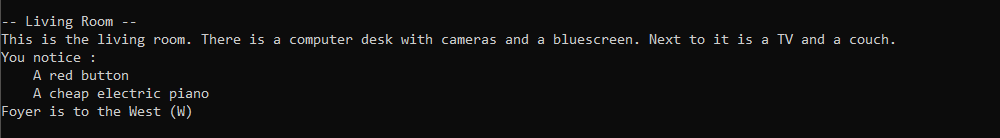
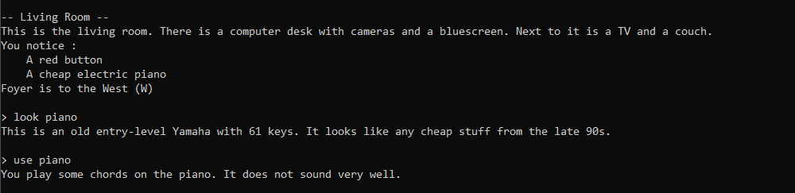
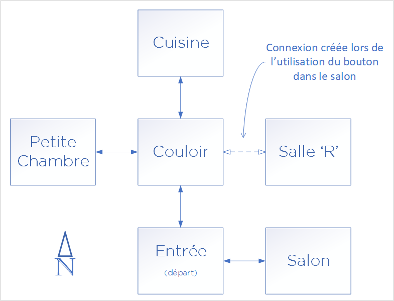
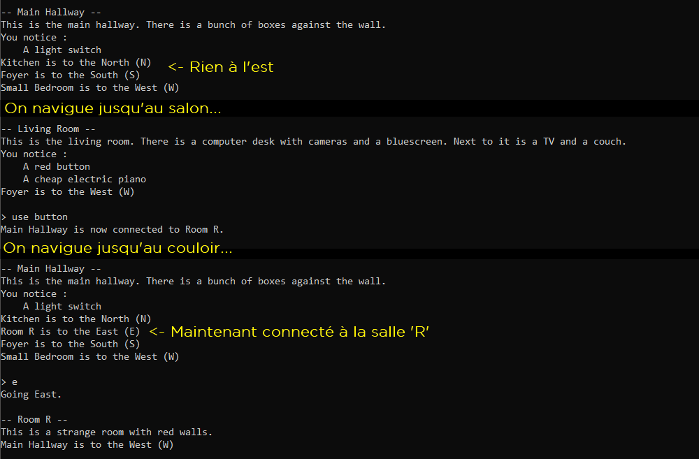
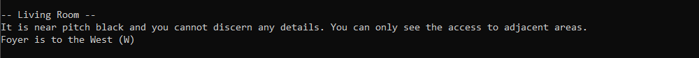
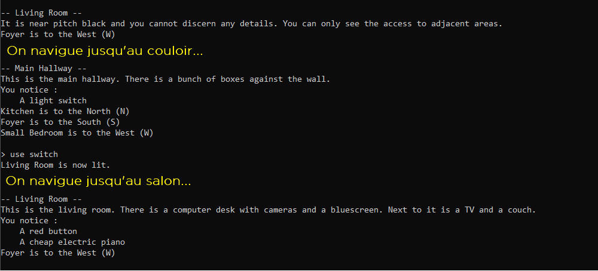
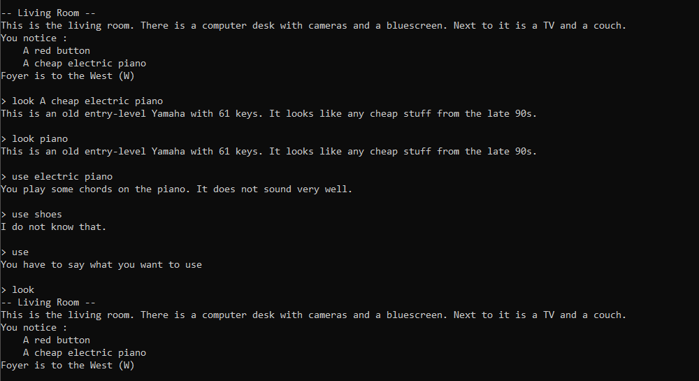

# Projet de session - Été 2021 - livrable 2

**Objectifs** : Introduire l’étudiant à la conception de programmes orientés objet en faisant des choix par rapport aux différents concepts vus dans ce cours. 

**Durée** : Presque toute la session.

**Livrables** :  
1. Évaluation 1 : Le 1er juin à 17h (créneau de rendez-vous pour chaque équipe)
1. Évaluation finale : Le 17 juin à 17h (créneau de rendez-vous pour chaque équipe)

## Directives particulières

- Vous devez suivre les bons principes de programmations appris dans le cours.
- Le côté artistique visuel n’est pas dans les critères d’évaluation, mais l'implémentation correcte d'une interface en ligne de commande et son utilisabilité le sont.
- Vous pouvez récupérer une partie des points perdus dans un livrable si vous corrigez les problèmes pour la remise finale. Pour cette raison, aucun solutionnaire ne sera donné, mais vous aurez des commentaires sur ce que vous avez fait.
- Le premier livrable est évalué principalement sur la conception et la fonctionnalité de base. Le travail aura une bonne proportion de l’évaluation sur le fonctionnement.
- Respectez le guide de codage, les points pertinents pour ce travail sont les mêmes que pour les TD.
- N’oubliez pas de mettre les entêtes de fichiers (guide point 33).
- Vous avez le droit d'utiliser des bibliothèques tierces telles que boost, cppitertools, gsl et tclap, mais seulement si leur utilisation n'affecte pas les objectifs pédagogiques du projet. Par exemple, si dans le projet on vous demande de développer un module d'opérations matricielles, vous ne pouvez pas utiliser une bibliothèque d'algèbre linéaire à la place. Toutefois, vous pourriez utiliser boost-format ou boost-algorithm pour faire de l'affichage formaté, vu qu'on ne vous évalue pas particulièrement sur votre capacité à manipuler des string à la main pour formater et que c'est complémentaire à ce qui est déjà présent dans la librairie standard de C++.
- Dans le dossier *Projet* vous trouverez une solution Visual Studio, un CMakeList et un JSON pour VSCode, tous fonctionnels et configurés pour Vcpkg, mais vous n'êtes pas obligés de vous en servir. Ce sont juste les fichiers de l'exemple disponible sur Moodle. Vous gérez vous-même votre environnement de développement.

## Description des nouvelles fonctionnalités du jeu

On ajoute des fonctionnalités par-dessus celles du livrable 1, qui étaient la navigation et l'observation des zones dans la carte. Vous pouvez vous référez à [README_Livrable1](README_Livrable1.md) pour le rappel de la description du livrable 1.

### Objets interactifs

En plus d'un nom et d'une description, une zone de la carte peut contenir des objets avec lesquelles le joueur peut interagir. Un objet interactif possède un nom et une description. Lorsqu'on affiche la description d'une zone, on affiche aussi le nom des objets interactifs présents dans la zone.

En regardant un objet avec la même commande que pour décrire une zone (`look` dans notre exemple), on obtient sa description. On peut utiliser l'objet avec une autre commande (`use` dans notre exemple), dont le message retourné dépend de l'objet.

<!--
### Inventaire

TODO: On le fait ou pas?
-->

### Objets déverrouillant de nouvelles zones

En interagissant avec certains objets, on veut pouvoir déverrouiller de nouvelles zones précédemment inaccessibles. Reprenons notre carte de l'exemple du livrable 1, mais en ajoutant une zone cachée (la *Salle R*) à l'est du couloir. Au départ, la salle n'est pas accessible à partir de ce dernier. En utilisant le bouton rouge qui se trouve dans le salon, la connexion se crée et l'accès à la salle est déverrouillé.

Voici le *gameplay* abrégé correspondant :

### Zones sombres et objets changeant l'éclairage

Certaines zones de la carte sont mal éclairées. On ne peut discerner aucun détail dans celles-ci autre que les accès aux zones connectées. On obtient donc une description générique disant qu'on ne voit rien et les objets présents dans la zone ne sont pas listés.

Certains objets permettent d'activer et de désactiver l'éclairage d'une zone. Un objet d'éclairage est lié à une zone en particulier (pas nécessairement la zone dans laquelle il se trouve). Dans l'exemple suivant (toujours reprennant la carte de la section précédente), le salon est initialement sombre et il y a un interrupteur dans le couloir qui permet de l'éclairer.

### Traitement des commandes d'objets

Les commandes `look` et `use` permettent d'interagir avec des objets. Il faut toutefois spécifier quel objet on veut regarder ou utiliser. On veut que la commande soit suivie d'une chaîne de caractère (possiblement avec des espaces) qui est une sous chaîne du nom de l'objet. Par exemple, l'objet avec le nom `A black leather jacket` pourrait être observé en faisant `look black leather jacket`, ou en faisant `look jacket`, car `black leather jacket` et `jacket` sont toutes deux des sous chaînes de `A black leather jacket`. Si plusieurs objets respectent le critère de recherche, on prend le premier trouvé.

Les mêmes règles de recherches s'appliquent pour `use` et pour `look`. Si on fait `look` sans rien après, on a le même comportement qu'au livrable 1, c'est-à-dire obtenir la description de la zone. `use` ne peut pas être utilisé sans argument.

## Description du livrable 2

### Exécution

Vous devez implémenter toutes les fonctionnalités présentées dans la description du projet ci-dessus et avoir une version fonctionnelle de votre jeu dans lequel on peut naviguer à travers la carte du monde, interagir avec des objets et utiliser toutes les fonctionnalités décrites ci-dessus. Par exemple, vous pourriez faire une carte où il faut éclairer des zones pour utiliser un objet débloquant une autre zone. On pourrait avoir à débloquer et éclairer des zones dans un certain ordre pour avoir accès à une dernière zone qui contient un message secret, une blague, une image en art ASCII, etc.

Comme dans le livrable 1, il faut donner à l'utilisateur une certaine rétroaction sur les commandes qu'il entre. Par exemple, utiliser la commande `use` sans arguments devrait afficher un message disant spécifiquement que la commande `use` doit être utilisée avec un nom d'objet ou un mot-clé.

### Conception

Vous devez concevoir la structure et le contenu de votre code selon une formule orientée-objet propre et facile à lire. Il doit vous être facile d'expliquer et de justifier vos choix spécifiques durant l'évaluation. Ci-dessous se trouvent quelques points nécessaires à prendre en compte dans votre code. Ce ne sont bien sûr pas les seuls, mais ce sont définitivement les plus importants et un bon point de départ. Vous devez aussi bien évidemment respecter le guide de conception du livrable 1.

#### Classes de zones

Vous avez déjà une classe représentant une zone dans le monde dans votre livrable 1. On vous demande maintenant d'ajouter des zones qui sont potentiellement mal éclairées. Ça devrait être deux classes différentes dans votre code. Il y aurait bien sûr du code et des données communes entre les zones normales et les zones à éclairage dynamique. Utilisez les bonnes notions d'orienté-objet pour éviter la duplication de code et permettre la manipulation facile de ces deux types de zones dans le code existant. Vous ne devriez pas avoir des séries de `if/else` dans votre code d'affichage pour chaque type de zone particulière. Servez-vous du polymorphisme.

Durant l'évaluation, il devrait être très facile (une ou deux lignes de code) de convertir une salle normale en salle mal éclairée. 

#### Classes d'objets interactifs

On vous demande aussi maintenant d'avoir des objets interactifs dans les zones. Il y a trois sortes d'objets jusqu'à présent :

1. Objets simples dont l'utilisation retourne un message sans affecter quoique ce soit d'autre.
1. Objets permettant de débloquer une nouvelle zone.
1. Objets permettant d'activer ou de désactiver l'éclairage dans une zone donnée.

Tous ces objets ont en commun le fait qu'ils ont un nom et une description et une action à appliquer. Le nom est affiché quand on liste les objets d'une zone et la description est donnée quand on observe l'objet (commande `look`). L'action est déclenchée par la commande `use` et l'effet dépend du type de l'objet.

Vous devriez avoir une classe différente pour chaque type d'objet. On ne veut pas une seule classe qui fait tout. Vous devriez aussi appliquer l'héritage et le polymorphisme pour faire abstraction des particularités spécifiques des objets là où seules les données communes sont utiles. Encore là, on ne veut pas de séries de `if/else` avec des `dynamic_cast` pour déterminer comment appliquer l'action d'un objet.

Durant l'évaluation, il devrait être facile d'ajouter un objet dans une zone en quelques lignes de code, tout comme l'ajout d'une zone dans le livrable 1 devait se faire facilement et proprement. Ajouter un objet déverrouillant un nouvelle pièce cachée ou éclairant une pièce sombre devrait aussi se faire facilement en quelques lignes.

#### Déverrouillage de nouvelles zones

Quand vous déverrouillez une nouvelle zone en utilisant un objet, ça devrait seulement créer une nouvelle connexion, pas une nouvelle zone en soi. La zone cachée devrait être déjà créée comme les autres zones et présente dans la carte du jeu, mais elle est seulement inaccessible avant d'utiliser l'objet approprié.

Par exemple, dans l'exemple de la section précédente la *Salle R* est initialement inaccessible, car elle n'est pas encore connectée au couloir. Elle est toutefois présente en mémoire et donc dans la carte du jeu. Le fait d'utiliser le bouton rouge dans le salon établit seulement la connexion avec le couloir. Si on déconnecte la salle, elle n'est pas détruite et on pourrait la reconnecter.

Durant l'évaluation, on pourrait vous demander de créer une zone et de la connecter à une des zones cachées (par exemple avoir une *Salle R2* à l'est de la *Salle R*). Les modifications au code pour faire ceci ne devraient pas être différentes de l'ajout d'une case connectée à n'importe quelle autre case qui n'a pas besoin d'être déverrouillée.

#### Séparation de l'affichage et du contenu

Tout comme dans le livrable 1, on veut séparer la logique d'interaction avec le joueur et le contenu du jeu. Il ne devrait pas y avoir des `cout` dans toutes les classes, mais seulement dans celles qui sont dédiées à l'interaction et l'affichage. Dans les classes de contenu du jeu (la carte, les zones, les objets), il faut donc prioriser le retour et la manipulation de message textuels plutôt que de faire des affichages directement dans celles-ci. Référez-vous à l'analogie de jeu de Pokémon de l'énoncé du livrable 1.

