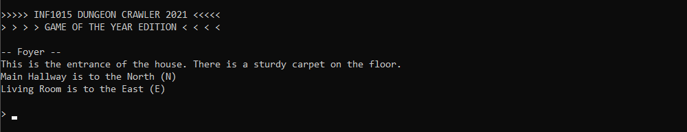
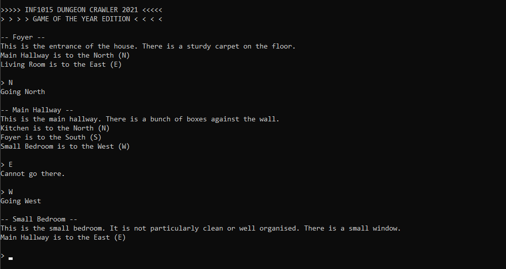
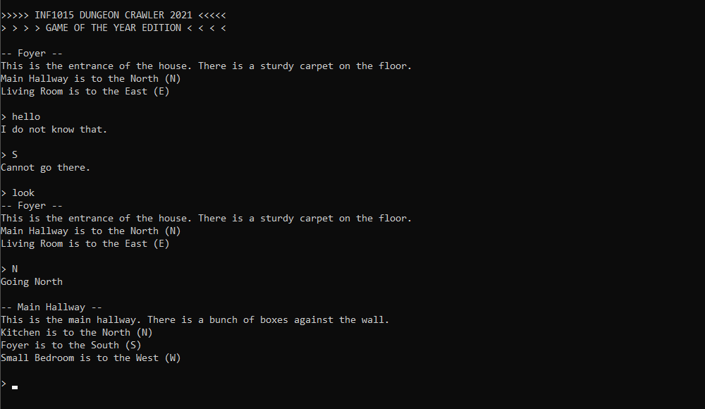

# Projet de session - Été 2021

**Objectifs** : Introduire l’étudiant à la conception de programmes orientés objet en faisant des choix par rapport aux différents concepts vus dans ce cours. 

**Durée** : Presque toute la session.

**Livrables** :  
1. Évaluation 1 : Le 1er juin à 18h (créneau de rendez-vous pour chaque équipe)
1. Évaluation finale : Le 17 juin à 18h (créneau de rendez-vous pour chaque équipe)

## Directives particulières

- Vous devez suivre les bons principes de programmations appris dans le cours.
- Le côté artistique visuel n’est pas dans les critères d’évaluation, mais l'implémentation correcte d'une interface en ligne de commande et son utilisabilité le sont.
- Vous pouvez récupérer une partie des points perdus dans un livrable si vous corrigez les problèmes pour la remise finale. Pour cette raison, aucun solutionnaire ne sera donné, mais vous aurez des commentaires sur ce que vous avez fait.
- Le premier livrable est évalué principalement sur la conception et la fonctionnalité de base. Le travail aura une bonne proportion de l’évaluation sur le fonctionnement.
- Respectez le guide de codage, les points pertinents pour ce travail sont les mêmes que pour les TD.
- N’oubliez pas de mettre les entêtes de fichiers (guide point 33).
- Vous avez le droit d'utiliser des bibliothèques tierces telles que boost, cppitertools, gsl et tclap, mais seulement si leur utilisation n'affecte pas les objectifs pédagogiques du projet. Par exemple, si dans le projet on vous demande de développer un module d'opérations matricielles, vous ne pouvez pas utiliser une bibliothèque d'algèbre linéaire à la place. Toutefois, vous pourriez utiliser boost-format ou boost-algorithm pour faire de l'affichage formaté, vu qu'on ne vous évalue pas particulièrement sur votre capacité à manipuler des string à la main pour formater et que c'est complémentaire à ce qui est déjà présent dans la librairie standard de C++.
- Dans le dossier *Projet* vous trouverez une solution Visual Studio, un CMakeList et un JSON pour VSCode, tous fonctionnels et configurés pour Vcpkg, mais vous n'êtes pas obligés de vous en servir. Ce sont juste les fichiers de l'exemple disponible sur Moodle. Vous gérez vous-même votre environnement de développement.

## Description du projet de jeu textuel

Nous voulons un jeu d'aventure textuelle, un peu comme les *Zork* de ce monde. Le jeu entier est en ligne de commande et l'utilisateur interagit avec le jeu en entrant du texte dans la console. On veut pouvoir se promener dans le monde du jeu et effectuer des actions dans celui-ci. Plusieurs exemples d'utilisation vous seront donnés dans les sections suivantes.

### Monde du jeu

Dans ce jeu, le monde est réparti en des zones, cellules ou cases qui peuvent être connectées entre elles dans les quatre directions cardinales (nord, sud, est, ouest). Chaque zone peut donc au maximum être connectée à 4 autres zones. Par exemple, on pourrait avoir la carte du monde suivant représentant une maison : 

À partir du couloir, on pourrait aller au Nord vers la cuisine, au sud vers l'entrée ou à l'ouest vers la chambre, par exemple. Dans votre code, le monde devrait donc ressembler à des cases connaissant leurs voisines.

### Acceuil et description des cases

Le jeu devrait commencer par afficher une petite bannière donnant le nom du jeu. Vous donnez au jeu le nom que vous voulez, mais il faut l'afficher au démarrage. On affiche ensuite le nom et la description de la case de départ (dans la maison ci-dessus ce serait l'entrée), puis les noms et directions des cases connexes. Enfin, on laisse à l'utilisateur un espace pour taper la commande qu'il veut exécuter.

On dit souvent dans le cours qu'il faut afficher un message d'invite avant de lire du clavier, du genre « Veuillez entrer votre commande : ». Dans le cas de notre jeu où l'utilisateur est toujours en train d'entrer des commandes, on pourrait simplement mettre un caractère spécial comme `$` ou `>`, de la même façon que les terminaux sur vos machines.

Voici un exemple d'exécution de cette partie :

Dans ce cas, *Foyer* est le nom de la case dans laquelle le joueur se trouve au début du jeu, donc la case de départ. On affiche ensuite la description détaillée de la case (ce que le joueur observerait dans un jeu graphique). On peut aussi voir que, tout comme sur la carte ci-dessus, on a le couloir (*Main Hall*) au nord et le salon (*Living Room*) à l'est.

### Navigation

La navigation dans le jeu, en supposant qu'on commence dans l'entrée, pourrait avoir l'air de ceci :

Ici on voit que l'utilisateur a entré une lettre pour aller au nord (*N* pour *North*), puis à l'ouest (*W* pour *West*). On voit aussi qu'il y a un petit feedback donné à l'utilisateur sur son action de navigation (« Going North » ou « Cannot go there »). En effet, il n'y a rien à l'est du couloir, donc on le dit à l'utilisateur et le joueur ne bouge pas. Quand on change de case, on affiche le nom et la description de la nouvelle case dans laquelle le joueur se trouve.

### Traitement des commandes de base

Dans le cadre du livrable 1, on veut une commande qui permet de réafficher le nom et la description de la case dans laquelle se trouve le joueur (par exemple `look`). Il faut aussi reconnaître les commandes de navigation, qui pourraient être tout simplement le nom ou l'abréviation (dans l'exemple la lettre) de la direction. Les commandes non reconnues devraient afficher un bref message qui l'indique. À chaque exécution d'une commande, on réaffiche l'invite et on attend l'entrée du clavier de l'utilisateur.

Remarquez qu'on donne, dans la liste des cases connexes à la case actuelle, la commande de navigation entre parenthèses. C'est une bonne idée pour aider le joueur à ne pas trop se casser la tête. Il serait encore mieux d'accepter comme commande de navigation à la fois la lettre et le nom de la direction (donc *N* ou *north* pour aller au nord).

Préférablement, l'utilisateur devrait être capable d'entrer toutes les commandes sans se soucier des minuscules ou majuscules ou des espaces superflues. Les fonctions d'algorithmes sur les chaines de caractères de boost telles que [trim_copy](https://www.boost.org/doc/libs/1_76_0/doc/html/boost/algorithm/trim_copy.html), [to_lower_copy](https://www.boost.org/doc/libs/1_76_0/doc/html/boost/algorithm/to_lower_copy.html) et [iequals](https://www.boost.org/doc/libs/1_76_0/doc/html/boost/algorithm/iequals.html) pourraient vous être très utiles dans la manipulation des string. C'est définitivement plus simple que d'écrire vous-même ces fonctions.

## Description du livrable 1

### Exécution

Vous devez implémenter toutes les fonctionnalités présentées dans la description du projet ci-dessus et avoir une version fonctionnelle de votre jeu dans lequel on peut naviguer à travers la carte du monde. Vous devriez avoir au moins 5 cases dans votre carte, dont une qui est connectée à plusieurs cases à la fois, et votre monde devrait avoir une case de départ prédéterminée. Il devrait être possible d'avoir une boucle dans la carte. Vous n'êtes pas obligés d'avoir exactement les mêmes noms de commandes que dans l'exemple précédent, mais vous devez avoir les mêmes commandes et donner du feedback au joueur par rapport aux commandes qu'il entre.

### Conception

Vous devez concevoir la structure et le contenu de votre code selon une formule orientée-objet propre et facile à lire. Il doit vous être facile d'expliquer et de justifier vos choix spécifiques durant l'évaluation. Ci-dessous se trouvent quelques points nécessaires à prendre en compte dans votre code. Ce ne sont bien sûr pas les seuls, mais ce sont définitivement les plus importants et un point de départ. Vous devez aussi respecter le guide de codage des TD et tout ce que ça implique.

#### Gestion de mémoire, de construction et de destruction propre et efficace

Assurez-vous que la possession et la responsabilité de la gestion des ressources sont claires dans vos classes. Vous devriez être facilement dire qui possède quoi dans votre code (quelle classe est responsable de telle ou telle ressource).

Vous devez utiliser de la mémoire allouée dynamiquement pour éviter les copies profondes là où c'est préférable. Il ne doit y avoir aucune fuite de mémoire. Vous avez appris à vous servir des pointeurs intelligents et des vecteurs, donc servez-vous-en. En gros, on ne veut aucun `new` et `delete` (ou encore pire `malloc()` et `free()`) écrits à la main dans votre code.

#### Fonctionnalités bien regroupées dans des classes et fichiers différents

Il est tout à fait possible de coder le jeu demandé au complet dans le `main()` avec quelques fonctions à-côté. Ce serait toutefois une conception bien pauvre et difficile à maintenir et à améliorer pour le livrable 2. On veut une conception orientée-objet où les fonctionnalités et les composantes sont regroupées dans des classes. Par exemple, vous devriez probablement avoir une classe qui représente une case du monde (son nom et sa description) et une autre classe qui représente la carte du jeu (toutes les cases). Vous pourriez décider d'avoir une classe représentant une connexion entre deux cases, ou mettre les connexions directement dans les cases. C'est un exemple des choix de conception que vous devez faire et justifier.

L'état du jeu, qui est pour l'instant pas mal seulement la case dans laquelle se trouve le joueur, devrait être aussi probablement gardé dans une classe, plutôt que dans des variables locales dans une fonction quelconque, dans le `main()` ou pire encore, dans des variables globales.

#### Séparation claire entre le contenu du monde et la logique du jeu

Pour éviter le code spaghetti et l'interdépendance inutile entre les éléments du programme, il devrait y avoir une séparation très claire et facilement identifiable entre les classes qui gèrent le contenu du monde et celles qui gèrent la logique et l'état du jeu et l'interaction avec le joueur. Par contenu du monde, on veut dire les cases, les connexions entre les cases, la case de départ et la carte du monde en général. Par logique de jeu, on parle du *gameplay* en soi, comme le formatage des affichages, l'analyse des commandes du joueur et la logique appliquée pour faire progresser le jeu.

Imaginez que vous devez programmer un jeu de combat de *Pokémon* en ligne de commande. Vous aurez probablement des classes qui représentent les Pokémon eux-mêmes, avec leurs attributs (*stats*) et leurs descriptions. Vous aurez d'autres classes représentant les attaques et les items utilisables par les Pokémon. Tout ça représenterait le contenu du jeu, plus ou moins indépendamment du flot d'exécution du jeu lui-même. Par-dessus cela, vous auriez toutes les classes qui gèrent les éléments de *gameplay* concrets, tels que l'affichage des HP des Pokémons et des attaques disponibles, le formatage des messages et la façon de sélectionner une attaque à prendre. On ne voudrait pas que ce soit fait directement dans les classes de Pokémon (avec des `cin` et des `cout` directement à l'intérieur). En effet, on voudrait pouvoir changer facilement l'affichage, ou même passer à une interface graphique avec des boutons, sans avoir à toucher aux classes qui dictent quels Pokémon peuvent prendre quelles attaques, par exemple.

Ceci étant dit, pour garder le code du projet d'une taille raisonnable, vous pouvez mettre directement dans votre code source les données des cases et des connexions plutôt que de les charger à partir d'un fichier. Cette partie de données *hard-codées* doit toutefois être assez bien isolée dans ses propres méthodes des classes de gestion de l'exécution du jeu.

#### Éviter la répétition et le code superflu, prioriser l'encapsulation

Votre code devrait être facile à utiliser et ne pas contenir trop de code superflu. Il devrait être facile de modifier certaines fonctionnalités spécifiques sans avoir à toucher à toutes les classes du projet. Les opérations devraient être faciles à faire. Par exemple, créer une nouvelle connexion entre deux cases devrait se faire en l'appel d'une ou deux méthodes.

Durant l'évaluation, si on vous demande de créer une nouvelle case avec un nom et une description donnée, puis de la connecter à une autre case existante, vous devriez être capable de le faire en faisant à peine quelques simples appels de méthodes et sans faire de copier-coller inutile. Changer la case de départ de votre carte devrait pouvoir se faire en une ou deux lignes de code.

